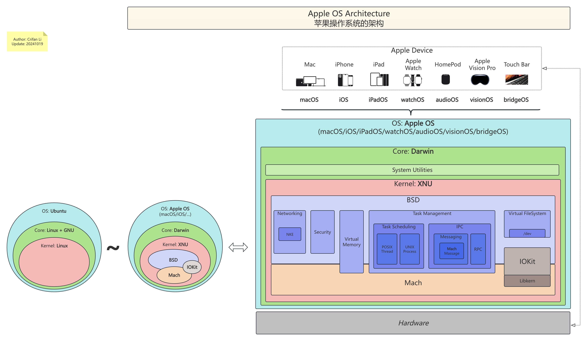

# 关系总结

此处给Apple操作系统常见概念：

`iOS`、`macOS`、`Darwin`、`XNU`、`Mach`、`BSD`、`FreeBSD`、`IOKit`

等的之间关系和逻辑，做个总结：

## 最终总结

* 苹果操作系统的架构 = Apple OS Architecture
  * 离线查看
    * 精简版
      * 
    * 完整版
      * 
  * 在线浏览
    * [苹果操作系统的架构 | ProcessOn免费在线作图](https://www.processon.com/view/link/67132a93e62924419e34ce08)

## 相关解释

### 总体关系逻辑

* Apple的不同平台有不同操作系统：`iPhone`的`iOS`、`Mac`的`macOS`等等
  * `iOS`、`macOS`等系统的内核，都是：`Darwin`
    * `Darwin` = `XNU` + 其他
      * `XNU` = `Mach` + `BSD` + `IOKit`

### 概念类比

* 内核关系类比
  * `Ubuntu`
    * `Ubuntu`是**操作系统**(`OS`)
      * `Linux + GNU` 是**核心部分**(`Core`)
        * `Linux`是**内核**(`Kernel`)
  * `macOS`
    * `macOS`是**操作系统**(`OS`)
      * `Darwin` 是**核心部分**(`Core`)
        * `XNU`是**内核**(`Kernel`)

### 范围大小

* 概念范围
  * 文字
    * `iOS` > `Darwin`
    * `macOS` > `Darwin`
    * `Darwin` > `XNU`
    * `XNU` > `Mach`
    * `XNU` > `BSD`
      * 主要是：`FreeBSD`
    * `XNU` > `IOKit`
