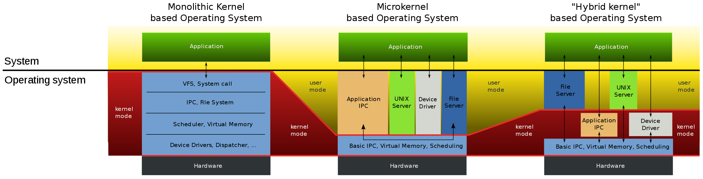

# XNU

* `XNU`= **X** is **N**ot **U**nix
  * 相关名词
    * `POSIX`=`Portable Operating System Interface`
    * `SMP`=`Symmetric MultiProcessing`
  * 是什么：
    * 一个混合内核（操作系统）
      * 解释：`Mach`是微内核（Microkernel） + `BSD` 是宏内核（Monolithic Kernel） = `XNU`是一个混合架构（Hybrid kernel）
    * 是（苹果的操作系统的核心）[Darwin](../darwin/README.md)的核心部分
  * 概述
    * 英文
      * XNU kernel is part of the Darwin operating system for use in macOS and iOS operating systems. 
    * 中文
      * XNU是：iOS（和tvOS、watchOS）的（操作系统）内核
      * XNU也是Darwin的一部分
        * Darwin是MacOS的操作系统内核
  * 目标
    * 实现既有微内核(Microkernel)的灵活性，又有宏内核(Monolithic Kernel)的良好性能
      * 微内核(Microkernel)指的是：`Mach`
        * 功能定义比较清晰 ~= 提高操作系统模块化程度
          * 内存管理 ~= 内存保护
          * 进程间（和处理器间）通信（IPC） ~= 消息传递的机制
          * 其他低级操作系统功能
        * 在操作系统和底层硬件之间，提供了一个有用的隔离层
      * 宏内核(Monolithic Kernel)指的是：`BSD`
        * 宏内核在高负荷下表现出高性能
        * BSD是一个精心设计的、成熟的操作系统，具有许多功能，和提供了一组行业标准API
          * 文件管理 ~= 文件系统
          * 设备访问
          * POSIX线程模型 == `pthread`
          * 网络
          * 等
        * 事实上，当今大多数商业UNIX和类UNIX操作系统都包含大量的BSD代码
  * 支持的CPU架构
    * x86_64
    * ARM
    * IA32

## 相关

### 内核类型对比

* 微内核（Microkernel） vs 宏内核（Monolithic Kernel） vs 混合架构（Hybrid kernel）
  * 说明：理解这几种内核的关键是需要注意内核模式和用户模式占据的范围
  * 对比
    * 
