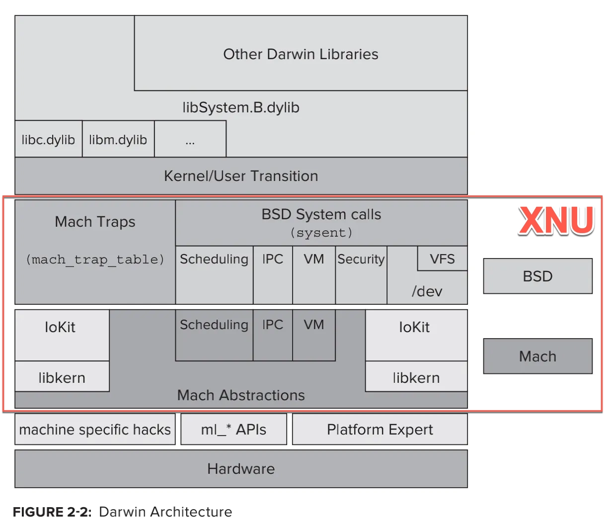

# XNU架构和组成

* XNU
  * 架构
    * Darwin的核心是XNU
      * 
    * XNU架构内部关系
      * 
    * XNU架构细节
      * 
  * 包括=组成
    * 概述
      * `XNU` = `Mach` + `BSD` + `IOKit`
        * 最初的：`XNU`=`Mach v2.5` + `BSD v4.3`
        * 后续的：`XNU`=`OSFMK v7.3` + `FreeBSD`
    * 详解
      * 微内核：`Mach`
        * 作用
          * 早期用于（`OS X Server`中的）`Apple`的`MkLinux`项目
        * 包含内容
          * `IPC`
          * `Memory`
          * `Parallel Execution`
          * `Real-Time Support`
          * `Console I/O`
          * `Security`
      * 宏内核：`BSD`
        * 包含内容
          * 进程和线程
            * `POSIX Thread Support`=`BSD Thread Model`=BSD线程模型=`pthreads`
            * `IPC`
          * 文件系统
            * `Virtual FileSystem`=虚拟文件系统
          * 网络
            * `Networing`= 网络协议栈
          * 其他
      * `IOKit`=`I/O Kit`=`IO Kit`
        * 设备驱动框架
          * 一个实现的面向对象的设备驱动API
          * 凭借`libkern`提供的底层支持，驱动程序可以使用`C++`实现。借助于`C++`的面向对象特性，外部在创建驱动程序时会节省很多成本。
