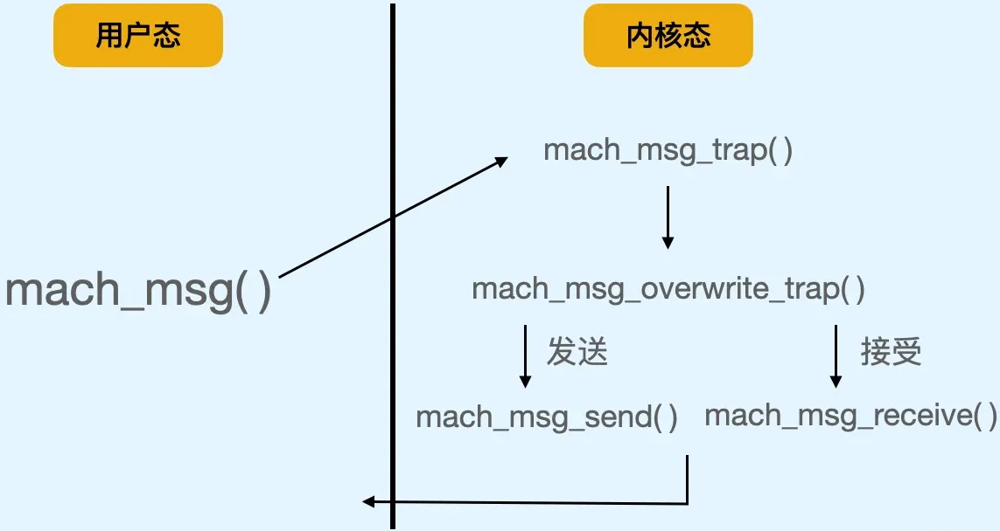
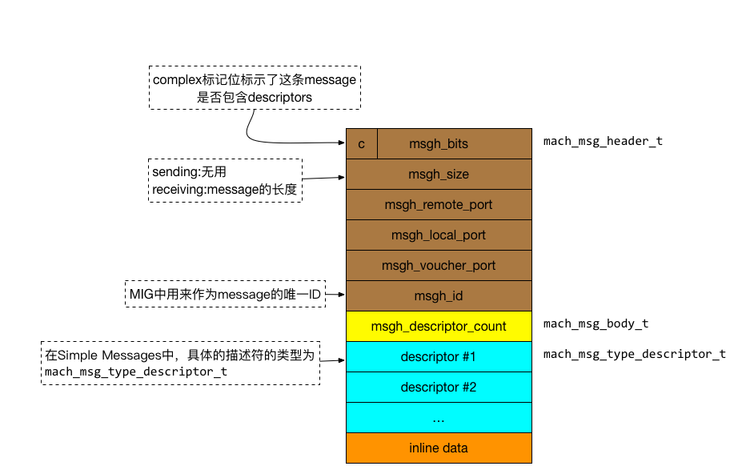

# Mach消息传递

* `Mach Message`=`Mach消息（传递）`
  * （Mach的`IPC`的）核心点
    * Mach最基础的概念就是两个端点`Port`中交换的`message`
  * message
    * 是什么：一个message就是msgh_size大小的blob, 带着一些flags，从一个端口发送到另一个端口
  * 核心函数
    * `mach_msg()`
    * `mach_msg_send()`
    * `mach_msg_receive()`
    * `mach_msg_trap()`
    * `mach_msg_overwrite_trap()`
  * 架构
    * 
  * Mach Message细节
    * 

### 相关定义

* `<mach/message.h>`

```c
typedef struct {
    mach_msg_header_t header;
    mach_msg_body_t   body;
} mach_msg_base_t;

// 消息头是必须的，它定义了一个消息所需要的数据
typedef struct {
    mach_msg_bites_t   msgh_bits;
    mach_msg_size_t    msgh_size;
    mach_port_t        msgh_remote_port;
    mach_port_t        msgh_local_port;
    mach_msg_size_t    msgh_reserved;
    mach_msg_id_t      msgh_id;
} mach_msg_header_t;

mach_msg_return_t mach_msg(mach_msg_header_t            msg,f
                           mach_msg_option_t            option,
                           mach_msg_size_t              send_size,
                           mach_msg_size_t              reveive_limit,
                           mach_port_t                  reveive_name,
                           mach_msg_timeout_t           timeout,
                           mach_port_t                  notify,
                           );
```