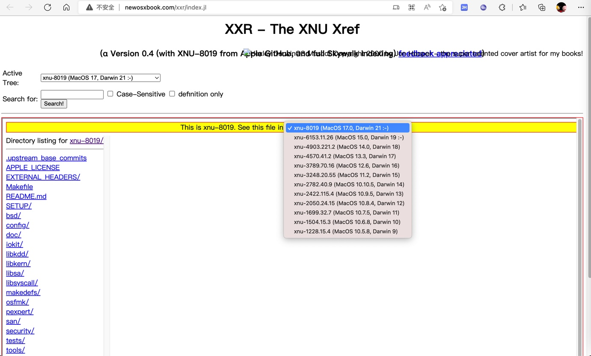

# XNU源码

* XNU源码
  * 旧：opensource.apple.com
    * 离线下载
      * https://opensource.apple.com/tarballs/xnu/
    * 在线浏览
      * https://opensource.apple.com/source/xnu/
  * 新：github.com
    * 旧
      * https://github.com/apple/darwin-xnu
    * 新
      * https://github.com/apple-oss-distributions/xnu
        * 源码下载
          * https://github.com/apple-oss-distributions/xnu/archive/refs/tags/
            * xnu-11215.1.10
              * https://github.com/apple-oss-distributions/xnu/archive/refs/tags/xnu-11215.1.10.zip
              * https://github.com/apple-oss-distributions/xnu/archive/refs/tags/xnu-11215.1.10.tar.gz
  * 其他
    * 在线浏览`xnu`代码
      * [XXR - XNU cross reference - Alpha (newosxbook.com)](http://newosxbook.com/xxr/index.jl)
        * 

## XNU代码核心部分

* XNU代码核心部分=代码树
  * `config` - configurations for exported apis for supported architecture and platform
  * `SETUP` - Basic set of tools used for configuring the kernel, versioning and kextsymbol management.
  * `EXTERNAL_HEADERS` - Headers sourced from other projects to avoid dependency cycles when building. These headers should be regularly synced when source is updated.
  * `libkern` - C++ IOKit library code for handling of drivers and kexts.
  * `libsa` - kernel bootstrap code for startup
  * `libsyscall` - syscall library interface for userspace programs
  * `libkdd` - source for user library for parsing kernel data like kernel chunked data.
  * `makedefs` - top level rules and defines for kernel build.
  * `osfmk` - Mach kernel based subsystems
  * `pexpert` - Platform specific code like interrupt handling, atomics etc.
  * `security` - Mandatory Access Check policy interfaces and related implementation.
  * `bsd` - BSD subsystems code
  * `tools` - A set of utilities for testing, debugging and profiling kernel.
